## Identificación de algoritmos de hash

Para identificar a que algoritmo de hasheo corresponde cada archivo se utilizaron dos páginas web: https://www.tunnelsup.com/hash-analyzer/ y https://hashes.com/en/tools/hash_identifier . Para esto se verificó en dichas páginas ingresando una contraseña aleatoria de cada archivo, lo que permitió validar los algoritmos de hasheo.

* Archivo 1: MD5
 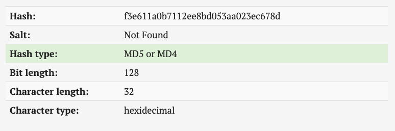
* Archivo 2: MD5 plus salt
 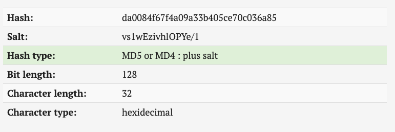
* Archivo 3: MD5 plus salt
 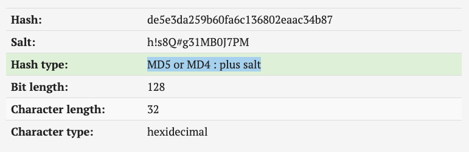
* Archivo 4: NTLM
 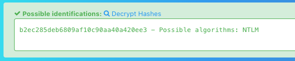
* * Archivo 5: sha512crypt
 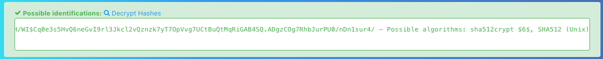


## Obtención de textos planos

Para obtener los textos planos de los archivos con contraseñas hasheadas se utilizó la función `crack_files`:

```python
def crack_files(files):
    for file in files:
        command = "hashcat -m " + str(file['mode']) + ' -o ' + file['output'] + ' ' + file['path'] + ' ' + DICCIONARIO_2 + ' --force' 
        start_time = time.time()
        os.system(command)
        print("--- %s seconds ---" % (time.time() - start_time))
```

Dicha función recibe de entrada un arreglo de archivos a crackear, donde cada archivo es un diccionario que posee la ruta donde se encuentra ubicado el archivo (`path`), el código del algoritmo de hasheo para identificar en hashcat `mode` y el archivo de salida a utilizar (`output`). Para poder descifrar las contraseñas se utiliza hashcat.

Este algoritmo fue utilizado bajo una máquina virtual con las siguientes características:

* Sistema operativo: Ubuntu 18.04LTS
* Memoria: 4096 MB

Mientras que la máquina base posee las siguientes características:
* Sistema operativo: MacOS Catalina 10.15.6
* Procesador: 3,6 GHz Quad-Core Intel Core i3
* Memoria: 16 GB 2400 MHz DDR4
* Gráfica: AMD Radeon R9 280X 3 GB

#### Resultados

Al ejecutar la función `rack_files()` se obtuvieron los siguientes tiempos para crackear cada uno de los archivos y la cantidad total de hash que posee cada archivo y cuantos de estos se lograron crackear:

* Archivo 1:
  * Tiempo: 2,35 segundos
  * Hash totales: 1000
  * Hash crackeados: 1000
  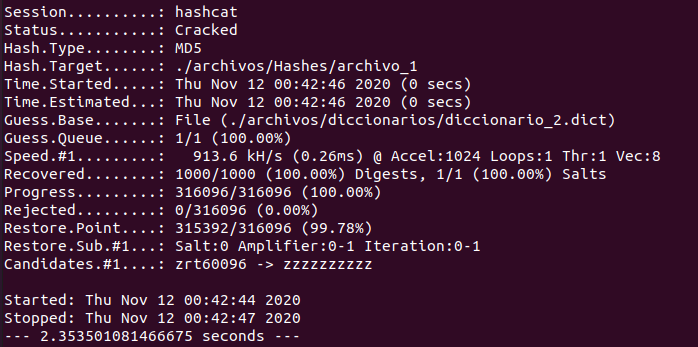
* Archivo 2:
  * Tiempo: 3,34 segundos
  * Hash totales: 1000
  * Hash crackeados: 1000
  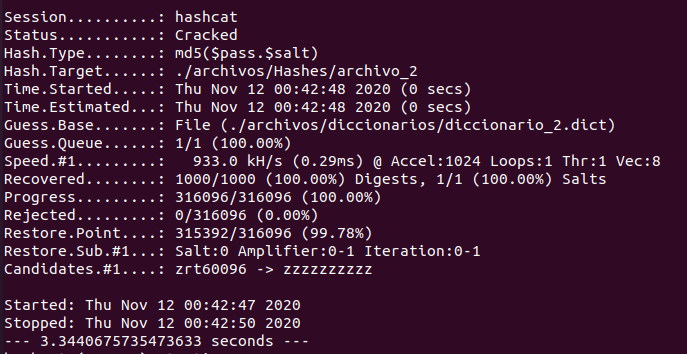
* Archivo 3:
  * Tiempo: 45.51 segundos
  * Hash totales: 1000
  * Hash crackeados: 1000
  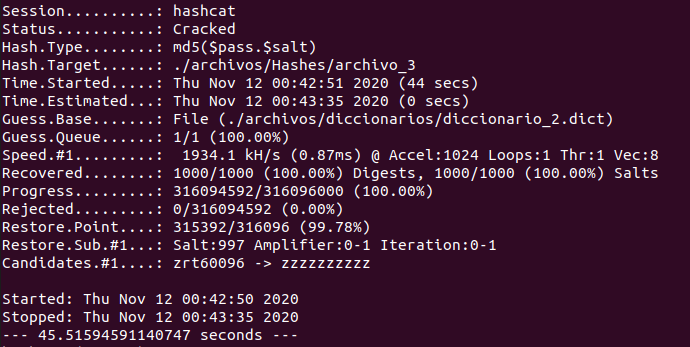
* Archivo 4:
  * Tiempo: 2,34 segundos
  * Hash totales: 1000
  * Hash crackeados: 1000
 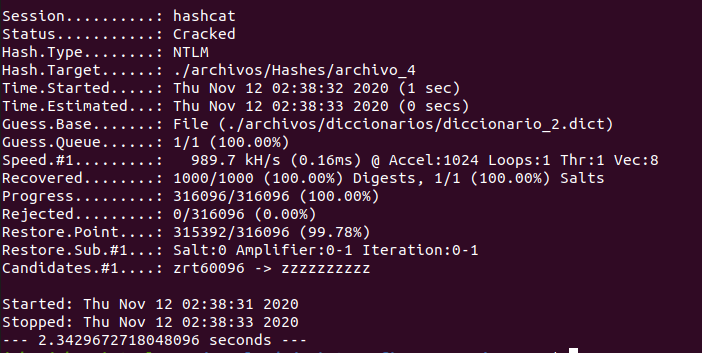
* Archivo 5:
  * Tiempo: 6647.11 segundos
  * Hash totales: 20
  * Hash crackeados:20
 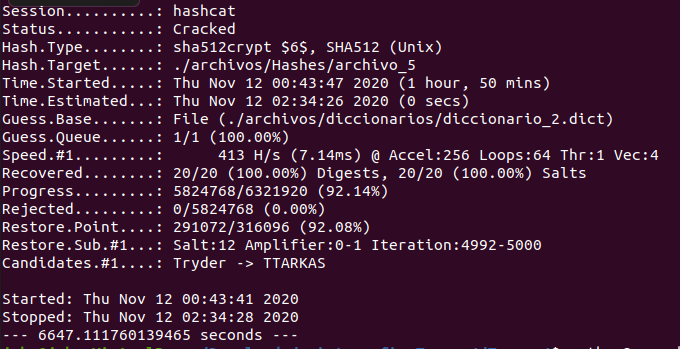

#### Diferencias

Mediante estas pruebas se puede apreciar que el algoritmo md5 es el algoritmo más rápido en descifrar las contraseñas, esto se debe a que es un algoritmo que no es resistente a colisiones y la capacidad de computo de la máquina es capaz de poder descifrar estas contraseñas rápidamente. En los hashes del archivo 2 a pesar de poseer un salt el algoritmo md5, este resulto descifrarse en un tiempo casi idéntico al md5 sin salt, debido a que al conocer el salt de las contraseñas solo resta saber la porción del hash que no corresponde al salt, al contrario de lo que ocurre en el algoritmo md5 plus salt del archivo 3, ya que cada contraseña en ese archivo posee un salt distinto. 

El algoritmo más seguro se utilizó en el archivo 5, que utiliza un algoritmo `sha512crypt`, esto se evidencia en el tiempo que tomó descifrar tan solo 20 contraseñas  debido a que este tipo de hash emplea más mecanismos para aumentar el tiempo requerido en descifrar los mensajes.


## Re-cifrado

Para volver a cifrar las contraseñas se utilizará el algoritmo `Bcrypt` por las siguientes razones:

* Salt: El que este algoritmo haga uso de `salt` permite siempre generar distintos cifrados para la misma contraseña.
* Lentitud: Bcrypt fue ideado para ser un algoritmo lento, lo que dificulta los ataques por fuerza bruta, al contrario de lo que podría ser un algoritmo de la familia SHA-2, que son diseñados para ser rápidos facilitando así estos ataques.

En primera instancia se utilizó la función `create_file()` para generar un archivo único con las 4020 contraseñas en texto plano:

```python
def create_file(files):
    new_file = open('passwords.txt', 'a')
    for file in files:
        password_file = open(file, 'r')
        for line in password_file:
            clean_password = line.split(':')[-1]
            new_file.write(clean_password)
```

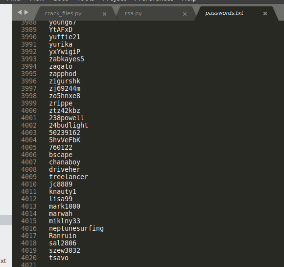

Luego, para realizar el re-cifrado en bcrypt se programó la función `rehash()`:

```python
def rehash():
    rehashed_passwords = open('passwords_bcrypt.txt', 'a')
    passwords = open('passwords.txt', 'r')
    print('Start rehash')
    start_time = time.time()
    for password in passwords:
        hashed = bcrypt.hashpw(password = password.strip().encode('utf-8'), salt = bcrypt.gensalt(rounds=10))
        rehashed_passwords.write(hashed.decode('utf-8') + '\n')
    print("--- %s seconds ---" % (time.time() - start_time))
```

La que, tras ser ejecutada, llevó un tiempo de 284.88 segundos en completar la operación.

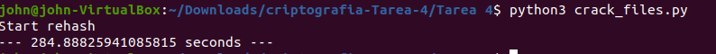

Estas contraseñas se encuentran en el archivo `passwords_bcrypt.txt` el cual contiene las 4020 contraseñas encriptadas utilizando el algoritmo `Bcrypt`.

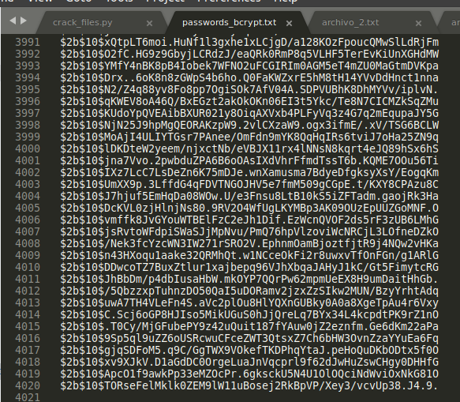

## Cifrado asimétrico

Se implementó el algoritmo de cifrado asimétrico RSA.

El proceso para generar la llave pública y privada se compone de diversos pasos:

1. Seleccionar dos números primos `p` y `q`. Para tener fuertes llaves públicas y privadas se recomienda utilizar números primos muy largos.
2. Computar `n`, que es el resultado de multiplicar `p` con `q`. `n = p * q`
3. Computar `λ(n)` que corresponde a la función de Charmichael. `λ(n) = (p – 1) * (q – 1) λ(n)`
4. Computar la llave de encriptación (`e`), que corresponde a un número tal que el máximo común divisor entre `e` y `λ(n)` sea 1, es decir, que `e` y `λ(n)` sean coprimos.
5. Computar la llave de desencriptado (`d`) que corresponde al inverso multiplicativo modular de `e` y se obtiene utilizando el algoritmo extendido de Euclides (`d ≡ e^(− 1) (mod λ(n))`). 

Esto se programó en la función `generate_keys()`

```python
def generate_keys(p, q):
	if not (is_prime(p) and is_prime(q)):
		raise ValueError('Ambos numeros deben ser primos')
	elif p == q:
		raise ValueError('Ambos numeros deben ser distintos')

	# Computa n
	n = p * q

	# Computa phi
	phi = (p - 1) * (q - 1)

	# Calcula la llave de encriptacion
	e = random.randrange(1, phi) # Escoge un numero entero
	g = greatest_common_divisor(e, phi) # Calcula el maximo comun divisor
	while g != 1: # Calcula numero hasta encontrar coprimos
		e = random.randrange(1, phi) 
		g = greatest_common_divisor(e, phi) 

	# Calcula la llave de desencriptacion
	d = modular_multiplicative_inverse(e, phi)[1]
	d = d % phi
	if d < 0:
		d += phi

	# Llave publica (e), llave privada(d) y n
	return (e, d, n)
```

## Solicitud de llaves

Para el proceso de solicitud de llaves se utilizó una conexión por sockets entre dos archivos, para esto el script `crack_files.py` actuará como cliente, conectándose vía socket al script `rsa.py` que actua como servidor.

Cliente:

```python
# Crea el TCP/IP socket
sock = socket.socket(socket.AF_INET, socket.SOCK_STREAM)

# Conecta al servidor
server_address = ('localhost', 10009)
print('connecting to {} port {}'.format(*server_address))
sock.connect(server_address)

BUFFER_SIZE = 1024

try:
    # Envia la peticion de llave publica
    message = b'REQUEST_PUBLIC_KEY'
    print('Sending {}'.format(message))
    sock.sendall(message)

    # Recibe la respuesta
    public_key = recv_message(sock)
    n = ''
    if public_key:
        public_key, separator, n = public_key.partition(b':')
    print('public_key {}'.format(public_key.decode('utf-8')))
    passwords_bcrypt = open('passwords_bcrypt.txt', 'r')
    encrypt_passwords(public_key, n, passwords_bcrypt)
    send_file(sock)

finally:
    print('closing socket')
    sock.close()
```

Servidor:

```python
# Crea el socket TCP/IPa
sock = socket.socket(socket.AF_INET, socket.SOCK_STREAM)

# Enlaza el socket al puerto
server_address = ('localhost', 10009)
print('Server started on {} port {}'.format(*server_address))
sock.bind(server_address)

# Espera por una conexion
sock.listen(1)

BUFFER_SIZE = 1024

while True:
	print('Waiting for a connection')
	connection, client_address = sock.accept()

	try:
		print('connection from', client_address)
		p,q = get_prime(), get_prime()
		while p == q:
			q = get_prime()
		# Recibe la peticion y envia las llaves
		while True: 
			request = connection.recv(BUFFER_SIZE)
			print('request: ', request)
			if request.decode('utf-8') == 'REQUEST_PUBLIC_KEY':
				public_key, private_key, n = generate_keys(p, q)
				print ('Public key: ', public_key)
				print ('Private key: ', private_key)
				print ('n: ', n)
				public_key = str(public_key) + ':' + str(n) 
				package = str(sys.getsizeof(public_key)) + ':' + str(public_key)
				connection.sendall(bytes(package.encode('utf-8')))
				filename = receive_file(connection)
				decrypt_file(str(private_key), n, filename)
				save_to_sqlite()
			else:
				print('no data required')
				break

	finally:
		# Cierra la coneccion
		connection.close()
```

## Cifrado de hashes utilizando RSA

Se utilizó la función en el archivo cliente que permite cifrar los hashes en Bcrypt pero ahora aplicándoles RSA.

```python
def encrypt_passwords(public_key, n, passwords):
    rsa_passwords = open('rsa_passwords.txt', 'a')
    print('=== Encriptando ===')
    for password in passwords:
        # Convierte cada letra en la contrasena a numeros, basado en el caracter utilizando a^b mod(m)
        cipher_password = [pow(ord(char), int(public_key.decode('utf-8')), int(n.decode('utf-8'))) for char in password]
        cipher_password = ''.join(map(lambda x: str(x), cipher_password))
        rsa_passwords.write(cipher_password + '\n')
    print('=== Finalizo encriptado ===')
```

Este algoritmo opera con la llave pública y el `n` que se obtienen vía socket del archivo servidor, donde una vez cifrados mediante RSA se envía el archivo con las 4020 contraseñas hasheadas al servidor mediante la  función :

```python
def send_file(sock):
    filename = 'rsa_passwords.txt'
    # Obtiene el tamano del archivo en bytes
    filesize = os.path.getsize(filename)
    print('=== Enviando archivo ===')
    # Envia el tamano y nombre del archivo
    sock.send(f'{filesize}:{filename}'.encode())
    progress = tqdm.tqdm(range(filesize), f'Sending {filename}', unit="B", unit_scale=True, unit_divisor=1024)
    with open(filename, 'rb') as file:
        for _ in progress:
            # Lee los bytes desde el archivo
            bytes_read = file.read(4096)
            if not bytes_read:
                # Termina la transmision
                break
            # Envia los bytes
            sock.sendall(bytes_read)
            # Actualiza la barra de progreso
            progress.update(len(bytes_read))
    print('=== Finaliza envio de archivo ===')
```

Una vez enviado este archivo se finaliza el proceso en el cliente.

En el servidor se cuenta con la función `receive_file()` que es la encargada de procesar el recibimiento del archivo con contraseñas desde el cliente para ser guardadas en el archivo `ser-rsa_passwords.txt` y posteriormente ser desencriptadas, utilizando la llave privada y el n, mediante la función `decrypt_file()`.

```python
def receive_file(connection):
	print('=== Recibiendo arvchivo ===')
	received = connection.recv(4096).decode()
	filesize, filename = received.split(':')
	# Elimina la path absoluta (siesque esta)
	filename = os.path.basename(filename)

	# Convierte el tamano del archivo a entero
	filesize = int(filesize)

	# Actualiza el nombre del archivo para diferenciarlo del archivo enviado por el cliente
	filename = 'server-' + filename

	# Comienza a recibir el archivo
	progress = tqdm.tqdm(range(filesize), f'Receiving {filename}', unit='B', unit_scale=True, unit_divisor=1024 )
	with open(filename, 'wb') as file:
		for _ in progress:
			# Lee 1024 bytes desde el socket
			bytes_read = connection.recv(4096)
			if not bytes_read:
				# Nada es recibido
				break
			# Escribe al archivo los bytes recibidos
			file.write(bytes_read)
			# Actualiza la barra de progreso
			progress.update(len(bytes_read))
	print('=== Finaliza de recibir archivo ===')
	return filename
```

```python
def decrypt_file(private_key, n, filename):
	print('=== Desencriptar archivo ===')
	file = open(filename, 'r')
	for rsa_password in file:
		bcrypt_password = decrypt(private_key, n, rsa_password)
	print('=== Finaliza desencriptado ===')

def decrypt(private_key, n, cipher_text):
	try: 
		password = [chr(pow(ord(char), private_key, n)) for char in cipher_text]
		return ''.join(password)
	except TypeError as e:
		pass

```

El procedimiento completo en simultaneo mediante sockets se puede evidenciar en la siguiene captura:

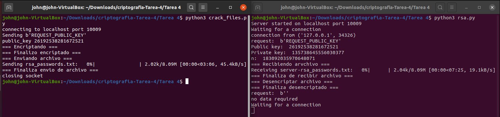

## Almacenamiento en SQLite

Finalmente, las contraseñas en encriptación Bcrypt se almacenan desde el servidor en una base de datos SQLite. Función que no se implementó.


## Enlaces

Github: https://github.com/JohnBidwellB/criptografia/tree/Tarea-4/Tarea%204