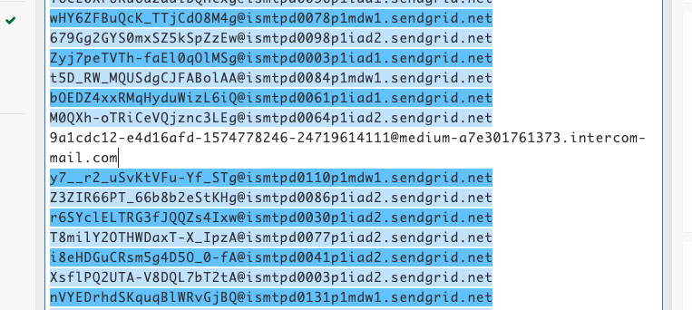
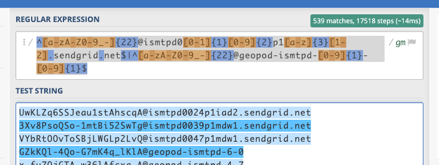

# Tarea 5

## Introducción

## Requerimientos

* Python 3
* imaplib: `pip3 install imaplib`

## Desarrollo

### Cliente de correo

Se utilizó la librería `imaplib` para poder construir el cliente de correo electrónico. Para esto es necesario hacer un par de ajustes en la cuenta de Google activando el acceso a aplicaciones poco seguras (https://myaccount.google.com/security). La función `connect()` realiza la conexión al servidor utilizando las variables `SERVER`, `EMAIL` y `PASSWORD` configurables en el archivo `credentials.py`.

```python
def connect():
    try:
        # Conecta al servidor
        mail = imaplib.IMAP4_SSL(SERVER)
        mail.login(EMAIL, PASSWORD)
        # Y selecciona el inbox
        mail.select('inbox')
        return(mail)
    except:
        print("Ha ocurrido un error")
```

Para poder leer los correos se implementó la función `search_by_email()`, la cual recibe como uno de sus parámetros la dirección de email que se desea buscar. Esta función busca utilizando todos los criterios disponibles de modo de obtener todos los emails, y retorna un listado con los `id` de cada uno de los mails.

```python
def search_by_email(client, email_to_search=None):
    status, data = client.search(None, 'FROM', email_to_search)
    # data corresponde a una lista de bytes [b'1 2 3', b'4 5 6']
    # Separación de los bytes
    mail_ids = []
    for block in data:
        # b'1 2 3'.split() => [b'1', b'2', b'3']
        mail_ids += block.split()
    return(mail_ids)
```

Mientras que la función `get_emails()` es la encargada de realizar un fetch a la data del email.

```python
def get_emails(client, result_bytes):
    msgs = []  
    # reversed() de modo de obtener desde el más reciente al más antiguo
    for num in reversed(result_bytes):
        typ, data = client.fetch(num, '(RFC822)')
        msgs.append(data)
    return msgs
```

La función `get_message_ids()` extrae el `Message-ID` del email y retorna una lista de listas [fecha, Message-ID]. Esta lista se puede encontrar en el archivo `messageids_date.txt` y todos los Message-ID encontrados en el archivo `messagesid.txt`.

```python
def get_message_ids(msgs):
    message_ids = []
    for msg in msgs:
        for sent in msg:
            if type(sent) is tuple:
                # Se codifica a utf-8
                content = str(sent[1], 'utf-8')
                data = str(content)
                try:
                    # Busca el Message-ID
                    index_start = data.find("Message-ID: <")
                    index_end = data.find(">", index_start)
                    message_id = data[index_start +
                                      len("Message-ID: <"): index_end]
                    # Busca la fecha
                    index_start = data.find("Received:")
                    index_start = data.find("\n", index_start)
                    index_end = data.find("-", index_start)
                    received_at = data[index_start:index_end].strip()

                    message_ids.append([received_at, message_id])
                except UnicodeEncodeError as e:
                    pass
    return(message_ids)
```

## Expresión regular

Se logró recopilar la información de los 540 mails disponibles en la cuenta, de los cuales 539 pasaron la prueba de la expresión regular, solo falló en un caso (ver imagen a continuación), el cual corresponde a un email enviado el día 26 de noviembre de 2019 el cual utiliza un servidor de email distinto. Sin embargo, el primer email en la bandeja de entrada corresponde al día 30 de enero, el cual si pasa la prueba de la expresión regular.



Y en la siguiente captura se puede ver como los 539 de 540 Message-ID analizados pasaron la prueba, teniendo como el email más antiguo el día 30 de enero de 2019 y el más reciente el día 26 de noviembre 2020.

