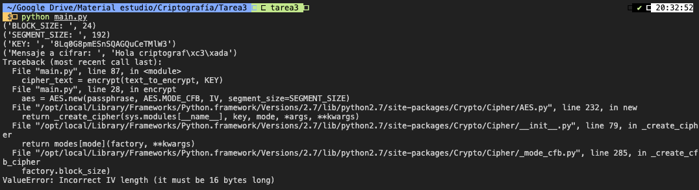
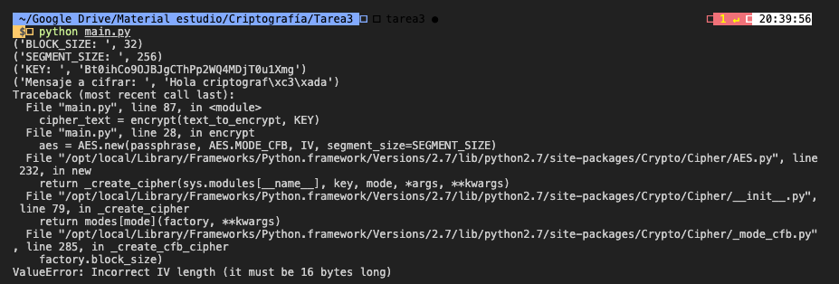

# Tarea 3 Criptografía y seguridad en redes

#### John Bidwell Boitano

En el presente documento se explica el funcionamiento de cifrado simétrico a través de la programación de scripts utilizando dos lenguajes de programación diferentes. Por un lado se utiliza `Python`, con el cual a través de la librería `Crypto` se encriptará un mensaje que será agregado a un archivo `HTML` para posteriormente a través de un scrypt implementado en `Javascript`, utilizando la librería `crypto-js` y alojado en la extensión `Tampermonkey`, permitirá descifrar el mensaje encriptado.

## Código Python

```python
#!/usr/bin/python
# -*- coding: utf-8 -*-

from Crypto import Random
from Crypto.Cipher import AES
import base64
import argparse
from sys import exit

BLOCK_SIZE = 16
SEGMENT_SIZE = 128
KEY = "2SQf1WNQnxYleSmg"  # Debe ser de BLOCK_SIZE caracteres
text_to_encrypt = "Hola criptografía"


def pad(data):
    length = BLOCK_SIZE - (len(data) % BLOCK_SIZE)
    return data + chr(length)*length


def unpad(data):
    return data[:-ord(data[-1])]


def encrypt(message, passphrase):
    IV = Random.new().read(BLOCK_SIZE)
    aes = AES.new(passphrase, AES.MODE_CFB, IV, segment_size=SEGMENT_SIZE)
    return base64.b64encode(IV + aes.encrypt(pad(message)))


def decrypt(encrypted, passphrase):
    encrypted = base64.b64decode(encrypted)
    IV = encrypted[:BLOCK_SIZE]
    aes = AES.new(passphrase, AES.MODE_CFB, IV, segment_size=SEGMENT_SIZE)
    return unpad(aes.decrypt(encrypted[BLOCK_SIZE:]))


def generate_HTML_file(cipher_text):
    html_text = """<p id="title">Este sitio contiene un mensaje secreto</p>"""
    html_div = """<div class="algorithm" id="%s"></div>""" % (cipher_text)
    html_decodedtext = """<div id="decodedText"></div>"""
    html_key = """<div class="algorithmKey" id="%s"></div>""" % KEY

    html_file = open('index.html', 'w')
    html_file.write(html_text)
    html_file.write(html_div)
    html_file.write(html_key)
    html_file.write(html_decodedtext)


if __name__ == "__main__":
    parser = argparse.ArgumentParser(
        description="Permite cifrar un mensaje utilizando el algoritmo Rijndael"
    )
    parser.add_argument("-k", "--key", dest="key", type=str, default="2SQf1WNQnxYleSmg",
                        help="Llave para cifrar/descifrar el mensaje, debe tener 16 caracteres")
    parser.add_argument("-t", "--text", dest="text",
                        type=str, help="Mensaje a cifrar")

    args = parser.parse_args()

    if (len(args.key) == 16):
        KEY = args.key
        if args.text:
            text_to_encrypt = args.text

        cipher_text = encrypt(text_to_encrypt, KEY)
        generate_HTML_file(cipher_text)
    else:
        print('Valores inválidos. Utilice el comando -h para obtener mayor información del scrypt.')
        exit()
```

Para la realización de este scrypt se utilizó la librería Crypto que posee la implementación del algoritmo de cifrado `AES` utilizando el modo `CFB`, además de las librerías `base64` para cambiar de base el mensaje encriptado y la librería `argparse` para poder cambiar los valos valores de las variables que utiliza el algoritmo.

El cifrar/descifrar mensajes utilizando esta librería require de 4 variables: `BLOCK_SIZE` que hace referencia al tamaño de los bloques, `SEGMENT_SIZE` al tamaño de los segmentos, `KEY` que corresponde a la llave que utiliza el algoritmo para poder cifrar el mensaje y `text_to_encrypt` que es el mensaje a encriptar. Cada una de estas variables posee valores por default. `IV` es otra de las variables importantes para este algoritmo, sin embargo esta es generada de forman random en base al `BLOCK_SIZE`.

También este algoritmo utiliza 5 funciones: `pad()` y `encrypt()` para encriptar el mensaje, `unpad()` y `decrypt()` para desencriptar el mensaje y `generate_HTML_file()` para generar el archivo `HTML`. Para los fines de esta tarea solo se utilizaron las funciones `pad()`, `encrypt()` y `generate_HTML_file()`, las dos restantes solo fueron utilizadas a modo de testeo.

* `encrypt()`

```python
def encrypt(message, passphrase):
    IV = Random.new().read(BLOCK_SIZE)
    aes = AES.new(passphrase, AES.MODE_CFB, IV, segment_size=SEGMENT_SIZE)
    return base64.b64encode(IV + aes.encrypt(pad(message)))
```

Esta función comienza generando un `IV` de manera random. Luego en la variables `aes` se crea una instancia de `AES` para posteriormente retorna un mensaje codificado en `base64`. Este mensaje contiene el `IV` generado además del mensaje encriptado utilizando `AES`. La función `pad()` lo que hace es rellenar el mensaje para dejarlo con una longitud múltiplo de `BLOCK_SIZE`.

* `generate_HTML_file()`

```python
def generate_HTML_file(cipher_text):
    html_text = """<p id="title">Este sitio contiene un mensaje secreto</p>"""
    html_div = """<div class="algorithm" id="%s"></div>""" % (cipher_text)
    html_decodedtext = """<div id="decodedText"></div>"""
    html_key = """<div class="algorithmKey" id="%s"></div>""" % KEY

    html_file = open('index.html', 'w')
    html_file.write(html_text)
    html_file.write(html_div)
    html_file.write(html_key)
    html_file.write(html_decodedtext)
```

Esta función es la encargada de generar el archivo `HTML` que contendrá el mensaje cifrado que posteriormente será descifrado utilizando `Javascript`.

Para poder ejecutar el scrypt se utilizan argumentos a través de la CLI que permite asignar valores a la KEY del algoritmo y también indicar el mensaje que se cifrará.

`python main.py -k 'CLAVE 16 CARACTERES' -t 'TEXTO A ENCRIPTAR'` 

#### Limitaciones del algoritmo

Este algoritmo presenta una serie de limitaciones donde la más importante es que solo permite un tamaño de bloque de 16 y tamaño de segmento de 128 bits, por lo que solo acepta una llave de 16 caracteres, sin embargo el texto a encriptar permite cualquier dimensión. Estas limitaciones se pueden presentar en las capturas a continuación, donde primero se utiliza un tamaño de bloque de 24, 192 bits como tamaño de segmento y una llave de 24 caracteres, en la segunda captura se utiliza un tamaño de bloque de 32, 256 bits para el tamaño del segmento y una llave de 32 caracteres.





Es debido a estas limitaciones que el algormitmo solo permite asignar nuevos valores a la clave y mensaje a cifrar, mientras que las otras variables del algoritmo solo es posible modificarlas modificando el código.

## Código Javascript

```javascript
// ==UserScript==
// @name         AES decription
// @namespace    http://tampermonkey.net/
// @version      0.1
// @description  Desencripta un mensaje cifrado mediante algoritmo AES
// @author       John Bidwell
// @match        https://htmlpreview.github.io/?https://github.com/JohnBidwellB/criptografia/blob/tarea3/Tarea3/index.html
// @require      https://cdnjs.cloudflare.com/ajax/libs/crypto-js/4.0.0/crypto-js.min.js
// @grant        none
// ==/UserScript==

(function () {
	"use strict";

	const cipheredText = document.getElementsByClassName("algorithm")[0].id;

	let ciphertext = CryptoJS.enc.Base64.parse(cipheredText);

	// split iv y ciphertext
	let iv = ciphertext.clone();
	iv.sigBytes = 16;
	iv.clamp();
	ciphertext.words.splice(0, 4); // delete 4 words = 16 bytes
	ciphertext.sigBytes -= 16;

	let htmlKey = document.getElementsByClassName("algorithmKey")[0].id;
	htmlKey = CryptoJS.enc.Utf8.parse(htmlKey);

	/** Por el lado del cliente, solo es posible modificar la llave, por lo que
	 * en caso de querer cambiarla se debe agregar la nueva llave de 16 caracteres
	 * en la variable customKey
	 */
	let customKey = null;
	if (customKey && customKey.length === 16) {
		customKey = CryptoJS.enc.Utf8.parse(customKey);
	} else {
    customKey = null
  }

	// desencriptado
	let decrypted = CryptoJS.AES.decrypt(
		{ ciphertext: ciphertext },
		customKey || htmlKey,
		{
			iv: iv,
			mode: CryptoJS.mode.CFB,
		}
	);

	const decryptedText = decrypted.toString(CryptoJS.enc.Utf8);

	if (decryptedText) {
		document.getElementById("title").innerHTML = "El mensaje oculto es";
		document.getElementById("decodedText").innerHTML = decryptedText;
	}
})();
```

Este scrypt utiliza la librería `crypto-js` y busca en el archivo `HTML` generado con `python` el texto cifrado y la llave de cifrado.

```const cipheredText = document.getElementsByClassName("algorithm")[0].id;```
 
La variable `cipheredText` contiene el texto cifrado que se almacena en el archivo `HTML` generado en `Python`,

```let ciphertext = CryptoJS.enc.Base64.parse(cipheredText);```

`cipherText` utiliza `CryptoJS` para parsear en base64 el texto cifrado.

```javascript
let iv = ciphertext.clone();
iv.sigBytes = 16;
iv.clamp();
```

`iv` contiene un clon de `ciphertext`. `sigBytes` corresponde al número de bytes significativos de las palabras mientras que `.clamp()` remueve los bits insignificantes.

```javascript
let htmlKey = document.getElementsByClassName("algorithmKey")[0].id;
htmlKey = CryptoJS.enc.Utf8.parse(htmlKey);
```

`htmlKey` obtiene la llave utilizada para cifrar el mensaje que viene contenida dentro de un `div` en el `HTML` para posteriormente ser parseado en `UTF-8`.

```javascript
let customKey = null;
if (customKey && customKey.length === 16) {
	customKey = CryptoJS.enc.Utf8.parse(customKey);
} else {
  customKey = null
}
```

En caso de querer modificar la clave para descifrar el mensaje se debe utilizar la variable `customKey` que debe tener un largo de 16 caracteres, ya que en caso contrario será asignada con un valor `null`.

```javascript
let decrypted = CryptoJS.AES.decrypt(
	{ ciphertext: ciphertext },
	customKey || htmlKey,
	{
		iv: iv,
		mode: CryptoJS.mode.CFB,
	}
);
```

Para desencriptar el mensaje se utiliza la función `decrypt()` de la librería `crypto-js`, esta función recibe como parámetros el tengo cifrado, la llave, y un objeto con el `iv` y el modo utilizado en el algoritmo, en este caso `CFB`.

```javascript
const decryptedText = decrypted.toString(CryptoJS.enc.Utf8);
if (decryptedText) {
	document.getElementById("title").innerHTML = "El mensaje oculto es";
	document.getElementById("decodedText").innerHTML = decryptedText;
}
```

Finalmente la variable `decryptedText` almacena en forma de `string` el mensaje ya desencriptado y, en caso de que el desencriptado sea exitoso, este mensaje se podrá visualizar a través del navegador.

Este scrypt se incorporó en `Tampermonkey`, donde se hace match a `https://htmlpreview.github.io/?https://github.com/JohnBidwellB/criptografia/blob/tarea3/Tarea3/index.html` que es un enlace que permite visualizar el `HTML` alojado en Github.

## Enlaces

Los enlaces del código utilizado son:

* Repositorio código: https://github.com/JohnBidwellB/criptografia/tree/tarea3/Tarea3
* Crypto: https://github.com/chrissimpkins/crypto
* crypto-js: https://github.com/brix/crypto-js
* Preview HTML: https://htmlpreview.github.io/?https://github.com/JohnBidwellB/criptografia/blob/tarea3/Tarea3/index.html

## Conclusiones

La realización de este trabajo permitió validar la correcta encriptación y desencriptación de mensajes utilizando dos lenguajes de programación diferentes. Si bien esto se logró exitosamente, el proceso para cumplir con lo requerido no estuvo excento de dificultades.

La principal dificultad que se tuvo fue al momento de encontrar librerías en ambos lenguajes que fueran compatibles, es por esto que se probó librerías que encriptaban y desencriptaban utilizando diferentes algoritmos de cifrado (Chacha, Camellia, Twofish, entre otros), sin embargo esto no se pudo completar debido a que las implementaciones en cada uno de los lenguajes no eran compatibles, por lo que no se logró descifrar correctamente, utilizando `Javascript`, los mensajes encriptados utilizando `Python`. Sin embargo, las librerías `crypto` y `crypto-js` resultaron ser completamente compatibles, por lo que se logró conseguir satisfactoriamente lo requerido.

Para finalizar, esto permite a los desarrolladores el generar aplicaciones seguras que utilicen las bondades de ambos lenguajes de programación utilizados para esta tarea, ya que `Python` es mayormente utilizado para generar `backend` de aplicaciones y `javascript` es utilizado para generar aplicaciones del lado del cliente, por lo que se comprobó que es posible el tener aplicaciones con algoritmos de encriptado robustos que permiten asegurar la información de los usuarios.