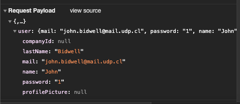
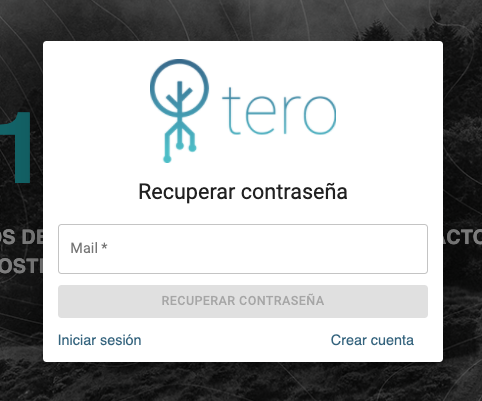
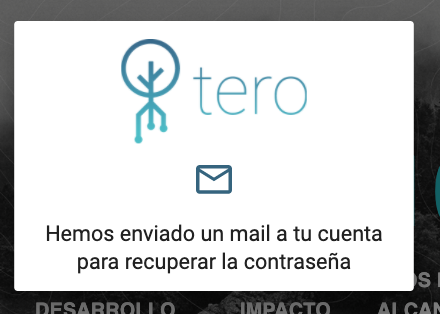
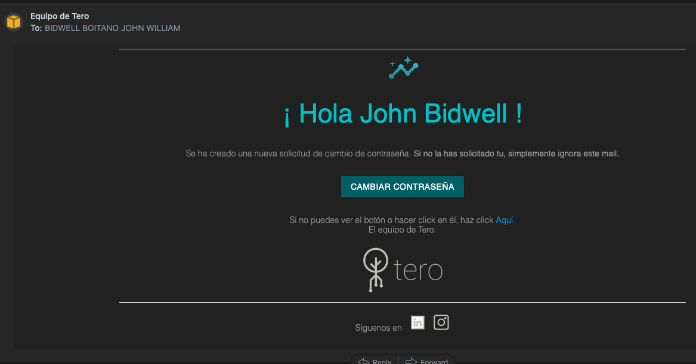
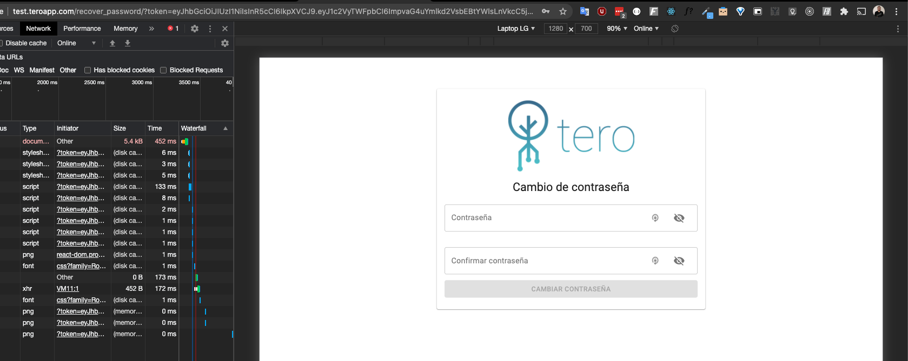
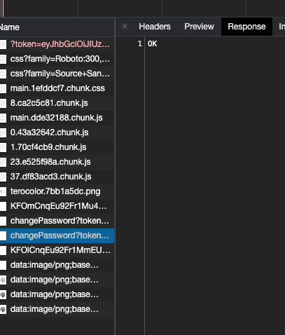
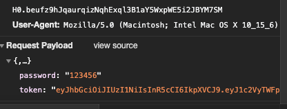
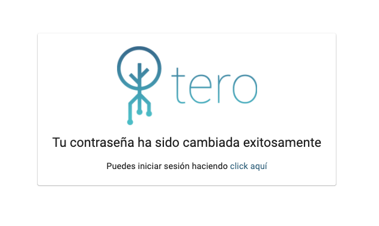

# test.teroapp.com

1.- ¿Cuál es el largo (L) mínimo y máximo de la contraseña a utilizar? ¿Cuál es la máxima base (W) que permite utilizar el sitio? (recuerde probar emojis, UTF-8, Unicode, etc)

El largo mínimo de la contraseña es de 1 caracter (suficiente para habilitar el botón de registro de usuario y enviar la petición).

El largo máximo de la contraseña es de XXXX caracteres

La máxima base W es XXXXXX

2.- ¿Se transmite la contraseña en texto plano?

Si se transmite en texto plano

3.- ¿Con qué nombre se envía el user y password al server? (Nombre en el request, no en el HTML)

El user se envía con el atributo `mail` y la contraseña con el atributo `password`.

4.- ¿Qué información se solicita para restablecer la contraseña?

Se solicita el mail del usuario

5.- ¿Cómo opera el servicio de reestablecer contraseña? (se envía la existente, se crea una temporal o el usuario resetea la antigua por una nueva)

Primero pide ingresar el email del usuario, tras lo cual muestra un mensaje de que se ha enviado un email a mi cuenta.

En dicho mail se encuentra un enlace en un botón, dicho enlace contiene un token.

Presionando el botón se abre el siguiente formulario:

y al entrar se envía una petición al backend (será para autenticar la validez del token?) con una respuesta `OK`.

Petición de cambio de contraseña

Contraseña cambiada exitosamente

Tras completar el proceso, para el cambio de la contraseña se reescribe la anterior y no se expone información privada del usuario, aparte de la contraseña en texto plano.

6.- ¿En el proceso de reseteo se expone información privada del usuario? ¿La información expuesta está completa o de forma parcial (n***@gmail.com)?

No se expone información privada del usuario.

7.- En caso de generar una password temporal. ¿Qué patrón tiene la nueva contraseña al resetearla? Automatice 10 reseteos de la contraseña para obtener el patrón de las nuevas contraseñas.

No genera password temporal.

8.- ¿El sitio recuerda contraseñas antiguas? ¿Cuántas? ¿Es posible eliminar esas passwords de la memoria del server (se pueden sobrescribir)?

No recuerda contraseñas antiguas.

9.- ¿Permite ataque por fuerza bruta? ¿Cómo lo evita? Pruebe automatizando 100 accesos (recuerde que su cuenta se podría inhabilitar o bloquear, por lo que deberá realizar este proceso al final)

10.- ¿Los resultados se condicen con las políticas de privacidad y seguridad del sitio?

No posee políticas de privacidad y seguridad.

11 - Indique 4 recomendaciones que podría hacer el sitio para evitar la automatización

* Tener un largo mínimo y máximo en la contraseña.
* Enviar contraseña encriptada al servidor.
  