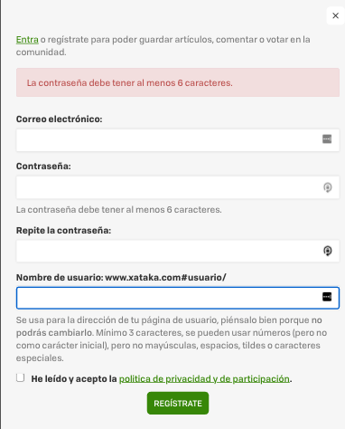
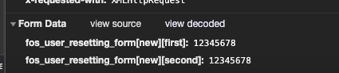
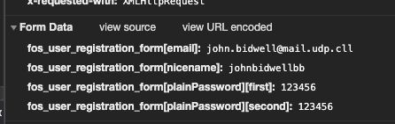
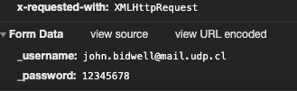
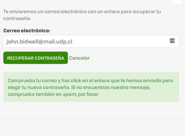
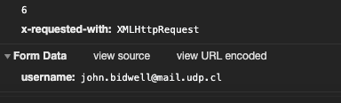

# test.teroapp.com

1.- ¿Cuál es el largo (L) mínimo y máximo de la contraseña a utilizar? ¿Cuál es la máxima base (W) que permite utilizar el sitio? (recuerde probar emojis, UTF-8, Unicode, etc)

El largo mínimo es de 6 caracteres

2.- ¿Se transmite la contraseña en texto plano?

Si se transmite en texto plano

Pero al tener un certificado SSL ests viaja cifrada al servidor

3.- ¿Con qué nombre se envía el user y password al server? (Nombre en el request, no en el HTML)
 En el registro: 
nombre de usuario: fos_user_registration_form[email]
contraseña: fos_user_registration_form[plainPassword][first]

En login:

username: _username
password: _password

4.- ¿Qué información se solicita para restablecer la contraseña?

Se solicita el email

5.- ¿Cómo opera el servicio de reestablecer contraseña? (se envía la existente, se crea una temporal o el usuario resetea la antigua por una nueva)

Se resetea la antigua por una nueva, además, el sistema no recuerda la contraseña antigua.

6.- ¿En el proceso de reseteo se expone información privada del usuario? ¿La información expuesta está completa o de forma parcial (n***@gmail.com)?

En el proceso se expone el email y la nueva contraseña del usuario.

7.- En caso de generar una password temporal. ¿Qué patrón tiene la nueva contraseña al resetearla? Automatice 10 reseteos de la contraseña para obtener el patrón de las nuevas contraseñas.

No genera

8.- ¿El sitio recuerda contraseñas antiguas? ¿Cuántas? ¿Es posible eliminar esas passwords de la memoria del server (se pueden sobrescribir)?

No recuerda contraseñas

9.- ¿Permite ataque por fuerza bruta? ¿Cómo lo evita? Pruebe automatizando 100 accesos (recuerde que su cuenta se podría inhabilitar o bloquear, por lo que deberá realizar este proceso al final)

10.- ¿Los resultados se condicen con las políticas de privacidad y seguridad del sitio?

11 - Indique 4 recomendaciones que podría hacer el sitio para evitar la automatización
